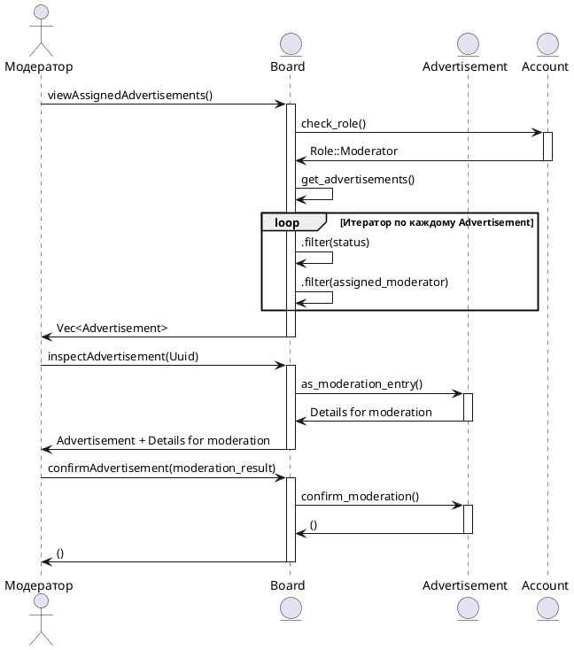

```plantuml
@startuml

actor Модератор
entity Board
entity Advertisement
entity Account

Модератор -> Board : viewAssignedAdvertisements()
activate Board
Board -> Account : check_role()
activate Account
Board <- Account : Role::Moderator
deactivate Account
Board -> Board : get_advertisements()
loop Итератор по каждому Advertisement
Board -> Board : .filter(status)
Board -> Board : .filter(assigned_moderator)
end
Модератор <- Board : Vec<Advertisement>
deactivate Board

Модератор -> Board : inspectAdvertisement(Uuid)
activate Board
Board -> Advertisement : as_moderation_entry()
activate Advertisement
Board <- Advertisement : Details for moderation
deactivate Advertisement
Модератор <- Board : Advertisement + Details for moderation
deactivate Board

Модератор -> Board : confirmAdvertisement(moderation_result)
activate Board
Board -> Advertisement : confirm_moderation()
activate Advertisement
Board <- Advertisement : ()
deactivate Advertisement
Модератор <- Board : ()
deactivate Board

@enduml
```
