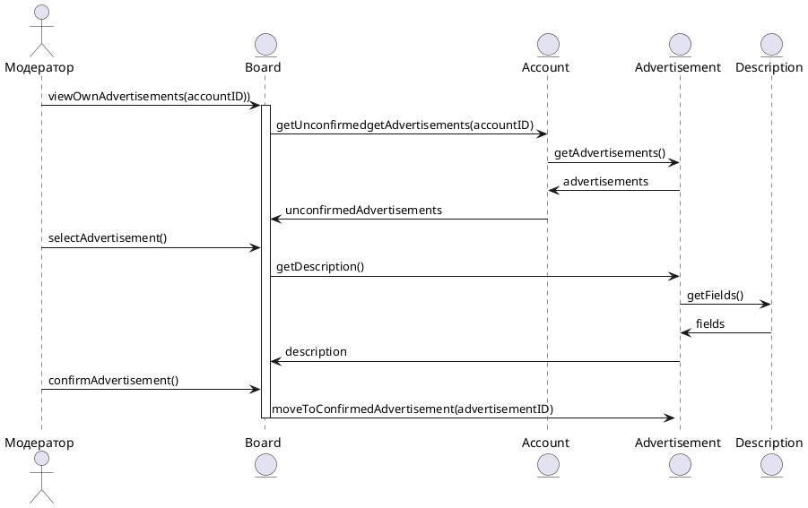

```plantuml
@startuml

actor Модератор
entity Board
entity Account
entity Advertisement
entity Description

Модератор -> Board : viewOwnAdvertisements(accountID))
activate Board
Board -> Account : getUnconfirmedgetAdvertisements(accountID)
Advertisement <- Account : getAdvertisements()
Advertisement -> Account : advertisements
Board <- Account : unconfirmedAdvertisements
deactivate Advertisement

Модератор -> Board : selectAdvertisement()
Board -> Advertisement : getDescription()
Advertisement -> Description : getFields()
Description -> Advertisement : fields
Advertisement -> Board : description

Модератор -> Board : confirmAdvertisement()
activate Advertisement
Advertisement <- Board : moveToConfirmedAdvertisement(advertisementID)
deactivate Board

@enduml
```
