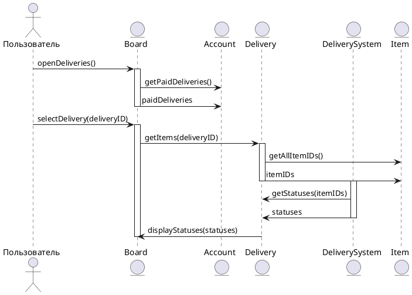

```plantuml
@startuml

actor Пользователь
entity Board
entity Account
entity Delivery
entity DeliverySystem
entity Item

Пользователь -> Board : openDeliveries()
activate Board
Board -> Account : getPaidDeliveries()
Account <- Board : paidDeliveries
deactivate Board

Пользователь -> Board : selectDelivery(deliveryID)
activate Board
Board -> Delivery : getItems(deliveryID)
activate Delivery
Delivery -> Item : getAllItemIDs()
Item <- Delivery : itemIDs
deactivate Delivery

activate DeliverySystem
DeliverySystem -> Delivery : getStatuses(itemIDs)
Delivery <- DeliverySystem : statuses
deactivate DeliverySystem

Delivery -> Board : displayStatuses(statuses)
deactivate Board

@enduml
```
