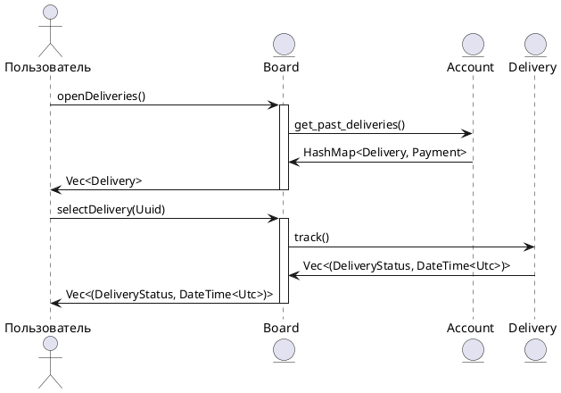

```plantuml
@startuml

actor Пользователь
entity Board
entity Account
entity Delivery

Пользователь -> Board : openDeliveries()
activate Board
Board -> Account : get_past_deliveries()
Board <- Account : HashMap<Delivery, Payment>
Пользователь <- Board : Vec<Delivery>
deactivate Board

Пользователь -> Board : selectDelivery(Uuid)
activate Board
Board -> Delivery : track()
Board <- Delivery : Vec<(DeliveryStatus, DateTime<Utc>)>
Пользователь <- Board : Vec<(DeliveryStatus, DateTime<Utc>)>
deactivate Board

@enduml
```
