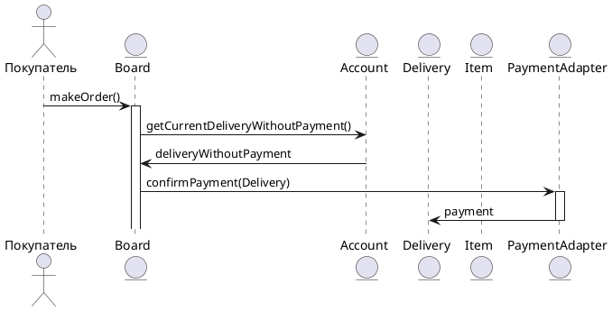

```plantuml
@startuml

actor Покупатель
entity Board
entity Account
entity Delivery
entity Item
entity PaymentAdapter

Покупатель -> Board : makeOrder()
activate Board
Board -> Account : getCurrentDeliveryWithoutPayment()
Account -> Board : deliveryWithoutPayment
deactivate Account

Board -> PaymentAdapter : confirmPayment(Delivery)

activate PaymentAdapter

PaymentAdapter -> Delivery : payment

deactivate PaymentAdapter
deactivate Delivery

@enduml
```
