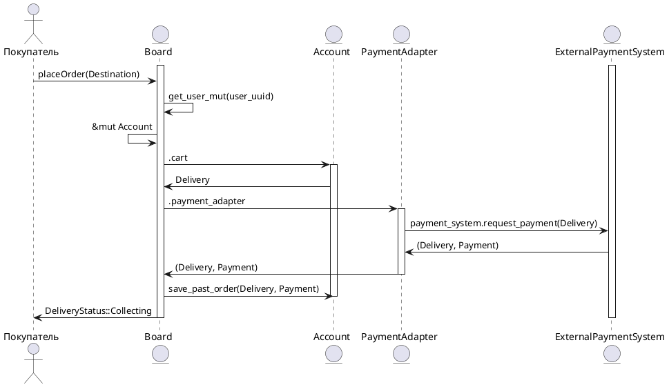

```plantuml
@startuml

actor Покупатель

entity Board
entity Account
entity PaymentAdapter
entity ExternalPaymentSystem

activate ExternalPaymentSystem
activate Board

Покупатель -> Board : placeOrder(Destination)
Board -> Board : get_user_mut(user_uuid)
Board <- Board : &mut Account
Board -> Account : .cart
activate Account
Board <- Account : Delivery
Board -> PaymentAdapter : .payment_adapter
activate PaymentAdapter
PaymentAdapter -> ExternalPaymentSystem : payment_system.request_payment(Delivery)
PaymentAdapter <- ExternalPaymentSystem : (Delivery, Payment)
Board <- PaymentAdapter : (Delivery, Payment)
deactivate PaymentAdapter
Board -> Account : save_past_order(Delivery, Payment)
deactivate Account
Покупатель <- Board : DeliveryStatus::Collecting

deactivate Board
deactivate ExternalPaymentSystem

@enduml
```
