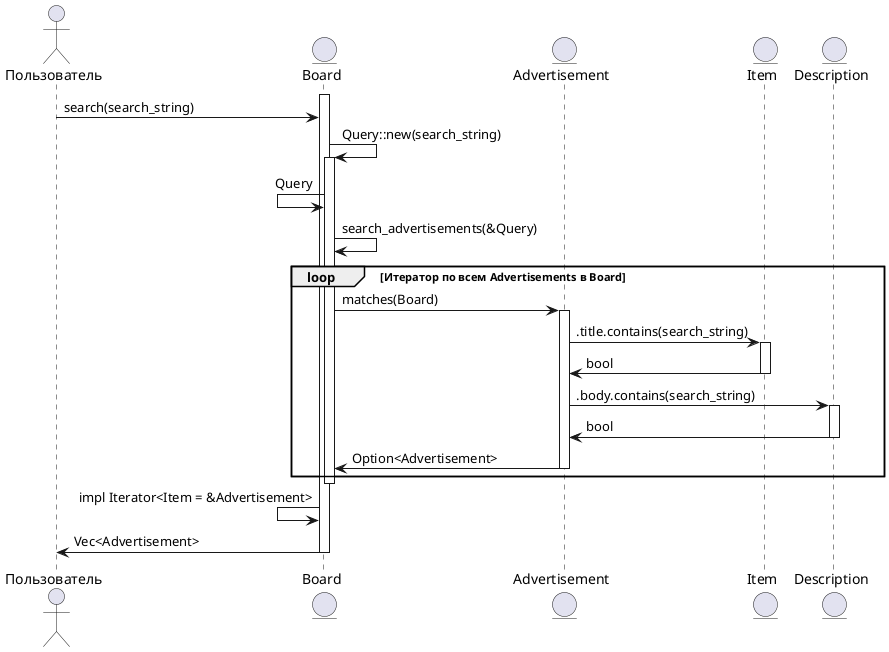

```plantuml
@startuml

actor Пользователь
entity Board
entity Advertisement
entity Item
entity Description

activate Board
Пользователь -> Board : search(search_string)
Board -> Board : Query::new(search_string)
activate Board
Board <- Board : Query
Board -> Board : search_advertisements(&Query)
loop Итератор по всем Advertisements в Board
Board -> Advertisement : matches(Board)
activate Advertisement
Advertisement -> Item : .title.contains(search_string)
activate Item
Advertisement <- Item : bool
deactivate Item
Advertisement -> Description : .body.contains(search_string)
activate Description
Advertisement <- Description : bool
deactivate Description
Board <- Advertisement : Option<Advertisement>
deactivate Advertisement
end
deactivate Board
Board <- Board : impl Iterator<Item = &Advertisement>
Пользователь <- Board : Vec<Advertisement>

deactivate Board

@enduml
```
