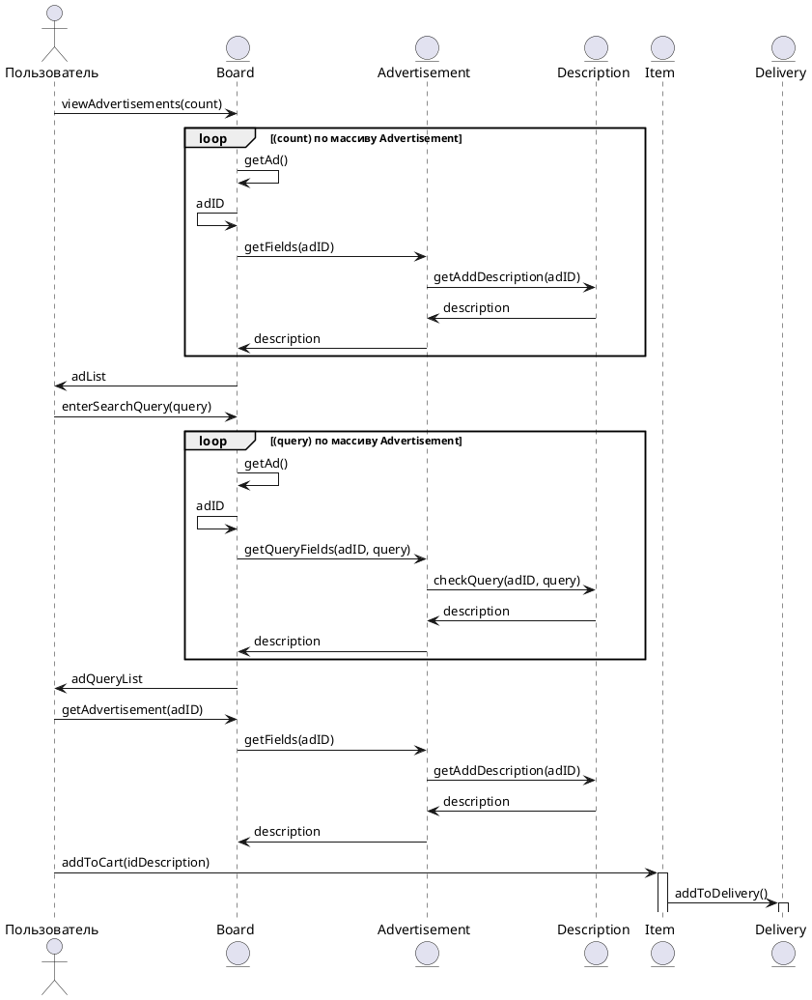

```plantuml
@startuml

actor Пользователь
entity Board
entity Advertisement
entity Description
entity Item
entity Delivery

Пользователь -> Board : viewAdvertisements(count)

loop (count) по массиву Advertisement
Board -> Board : getAd()
Board <- Board : adID
Board -> Advertisement : getFields(adID)
Advertisement -> Description : getAddDescription(adID)
Advertisement <- Description : description
Board <- Advertisement : description
end

Board -> Пользователь : adList

Пользователь -> Board : enterSearchQuery(query)

loop (query) по массиву Advertisement
Board -> Board : getAd()
Board <- Board : adID
Board -> Advertisement : getQueryFields(adID, query)
Advertisement -> Description : checkQuery(adID, query)
Advertisement <- Description : description
Board <- Advertisement : description
end

Board -> Пользователь : adQueryList

Пользователь -> Board : getAdvertisement(adID)
Board -> Advertisement : getFields(adID)
Advertisement -> Description : getAddDescription(adID)
Description -> Advertisement : description
Board <- Advertisement : description


Пользователь -> Item : addToCart(idDescription)
activate Item
Item -> Delivery : addToDelivery()
activate Delivery

@enduml
```
