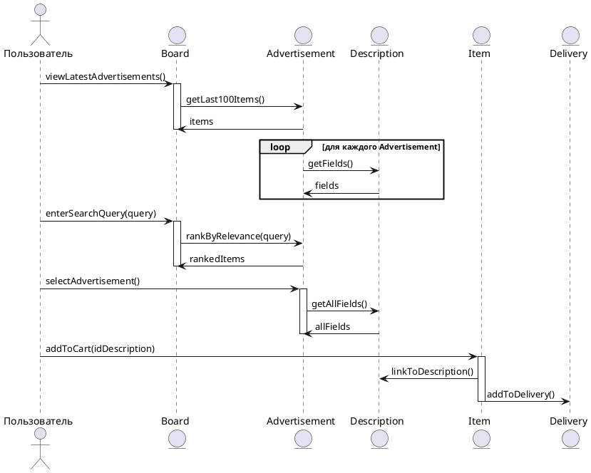

```plantuml
@startuml

actor Пользователь
entity Board
entity Advertisement
entity Description
entity Item
entity Delivery

Пользователь -> Board : viewLatestAdvertisements()
activate Board
Board -> Advertisement : getLast100Items()
Board <- Advertisement : items
deactivate Board

loop для каждого Advertisement
Advertisement -> Description : getFields()
Description -> Advertisement : fields
end

Пользователь -> Board : enterSearchQuery(query)
activate Board
Board -> Advertisement : rankByRelevance(query)
Advertisement -> Board : rankedItems
deactivate Board

Пользователь -> Advertisement : selectAdvertisement()
activate Advertisement
Advertisement -> Description : getAllFields()
Description -> Advertisement : allFields
deactivate Advertisement

Пользователь -> Item : addToCart(idDescription)
activate Item
Item -> Description : linkToDescription()
Item -> Delivery : addToDelivery()
deactivate Item

@enduml
```
