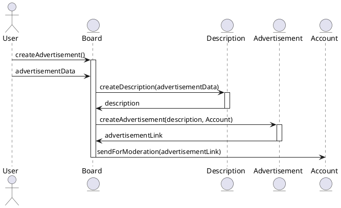

```plantuml
@startuml

actor User
entity Board
entity Description
entity Advertisement
entity Account

User -> Board : createAdvertisement()
activate Board
User -> Board : advertisementData

Board -> Description : createDescription(advertisementData)
activate Description
Description -> Board : description
deactivate Description

Board -> Advertisement : createAdvertisement(description, Account)
activate Advertisement
Advertisement -> Board : advertisementLink
deactivate Advertisement

Board -> Account : sendForModeration(advertisementLink)
deactivate Board
deactivate Account

@enduml
```
