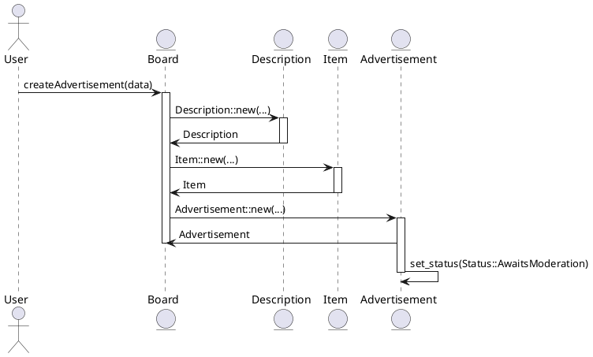

```plantuml
@startuml

actor User
entity Board
entity Description
entity Item
entity Advertisement

User -> Board : createAdvertisement(data)
activate Board

Board -> Description : Description::new(...)
activate Description
Board <- Description : Description
deactivate Description

Board -> Item : Item::new(...)
activate Item
Board <- Item : Item
deactivate Item

Board -> Advertisement : Advertisement::new(...)
activate Advertisement
Board <- Advertisement : Advertisement
deactivate Board
Advertisement -> Advertisement : set_status(Status::AwaitsModeration)
deactivate Advertisement

@enduml
```
