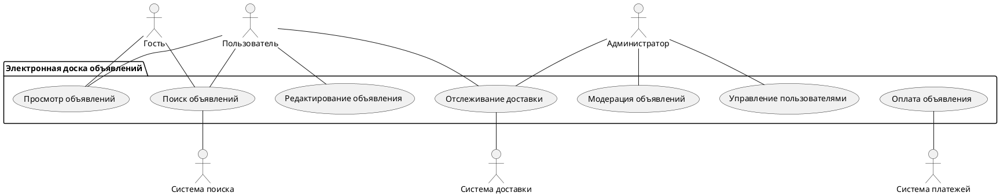

#Диаграмма прецедентов UML для "Электронной доски"

```plantuml
@startuml

:Пользователь:
:Администратор:
:Гость:
:Система доставки:
:Система платежей:
:Система поиска:

package "Электронная доска объявлений" {
:Гость: -- (Просмотр объявлений)
:Гость: -- (Поиск объявлений)

:Пользователь: -- (Редактирование объявления)
:Пользователь: -- (Просмотр объявлений)
:Пользователь: -- (Поиск объявлений)
:Пользователь: -- (Отслеживание доставки)

:Администратор: -- (Модерация объявлений)
:Администратор: -- (Управление пользователями)
:Администратор: -- (Отслеживание доставки)

(Оплата объявления) -- :Система платежей: 

(Поиск объявлений) -- :Система поиска:
  
(Отслеживание доставки) -- :Система доставки:
}

@enduml
```
