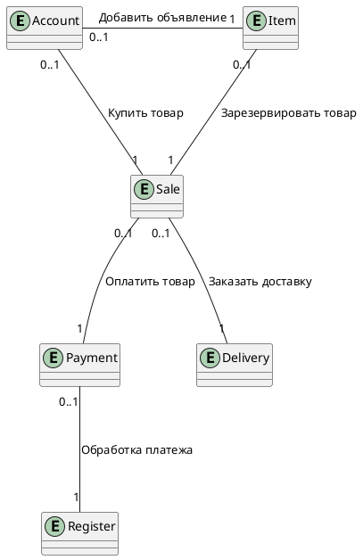

```plantuml
@startuml


entity Account
{
  
}

entity Item {

}

entity Sale
{
    
    
}

entity Payment
{
    
}

entity Delivery
{
    
}

entity Register
{

}

Account "0..1" -right-- "1" Item : Добавить объявление
Account "0..1" -right-- "1" Sale : Купить товар


Item "0..1" -down-- "1" Sale : Зарезервировать товар

Sale "0..1" -down-- "1" Payment : Оплатить товар
Sale "0..1" -down-- "1" Delivery : Заказать доставку

Payment "0..1" -down-- "1" Register : Обработка платежа


@enduml
```
