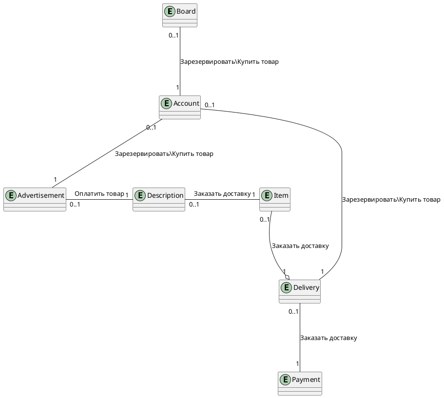

```plantuml
@startuml

entity Board
{

}

entity Account
{
  
}

entity Advertisement
{
    
    
}

entity Payment
{
    
}

entity Delivery
{
    
}

entity Item
{
    
}

entity Description
{
    
}


Board "0..1" -down-- "1" Account : Зарезервировать\Купить товар
Account "0..1" -down-- "1" Advertisement : Зарезервировать\Купить товар
Account "0..1" -down-- "1" Delivery : Зарезервировать\Купить товар

Advertisement "0..1" -right-- "1" Description : Оплатить товар
Description "0..1" -right-- "1" Item : Заказать доставку

Item "0..1" -down--o "1" Delivery : Заказать доставку

Delivery "0..1" -down-- "1" Payment : Заказать доставку


@enduml
```
