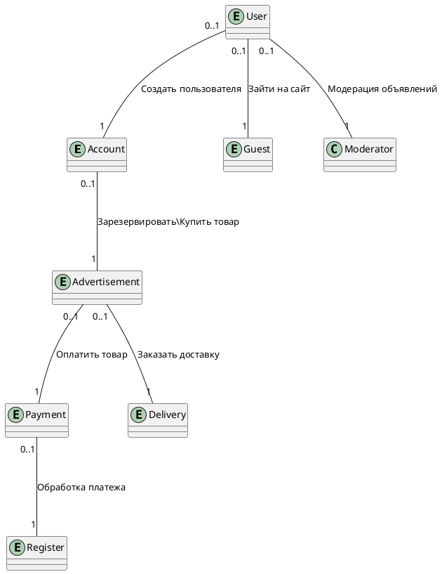

```plantuml
@startuml


entity Account
{
  
}

entity User {

}

entity Guest {

}

entity Advertisement
{
    
    
}

entity Payment
{
    
}

entity Delivery
{
    
}

entity Register
{

}

User "0..1" -down-- "1" Account : Создать пользователя
User "0..1" -down-- "1" Guest : Зайти на сайт
User "0..1" -down-- "1" Moderator : Модерация объявлений


Account "0..1" -down-- "1" Advertisement : Зарезервировать\Купить товар

Advertisement "0..1" -down-- "1" Payment : Оплатить товар
Advertisement "0..1" -down-- "1" Delivery : Заказать доставку

Payment "0..1" -down-- "1" Register : Обработка платежа


@enduml
```
