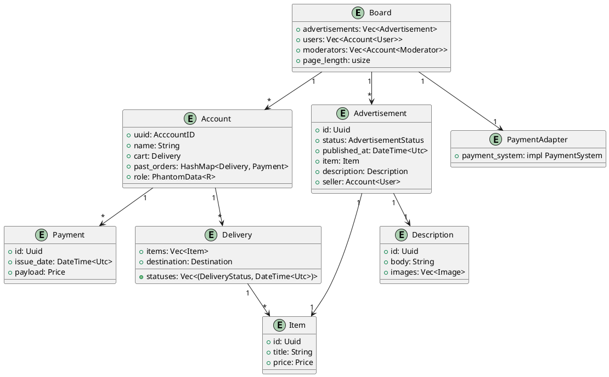

```plantuml
@startuml
entity Board {
  +advertisements: Vec<Advertisement>
  +users: Vec<Account<User>>
  +moderators: Vec<Account<Moderator>>
  +page_length: usize
}

entity Account {
  +uuid: AcccountID
  +name: String
  +cart: Delivery
  +past_orders: HashMap<Delivery, Payment>
  +role: PhantomData<R>
}

entity Advertisement {
  +id: Uuid
  +status: AdvertisementStatus
  +published_at: DateTime<Utc>
  +item: Item
  +description: Description
  +seller: Account<User>
}


entity Payment {
  +id: Uuid
  +issue_date: DateTime<Utc>
  +payload: Price
}

entity Delivery {
  +items: Vec<Item>
  +statuses: Vec<(DeliveryStatus, DateTime<Utc>)>
  +destination: Destination
}

entity Item {
  +id: Uuid
  +title: String
  +price: Price
}

entity Description {
  +id: Uuid
  +body: String
  +images: Vec<Image>
}

entity PaymentAdapter {
  +payment_system: impl PaymentSystem
}

Board "1" --> "*" Account
Board "1" --> "1" PaymentAdapter
Board "1" --> "*" Advertisement 

Advertisement "1" --> "1" Description 
Advertisement "1" --> "1" Item 

Account "1" --> "*" Delivery
Account "1" --> "*" Payment

Delivery "1" --> "*" Item

@enduml
```
